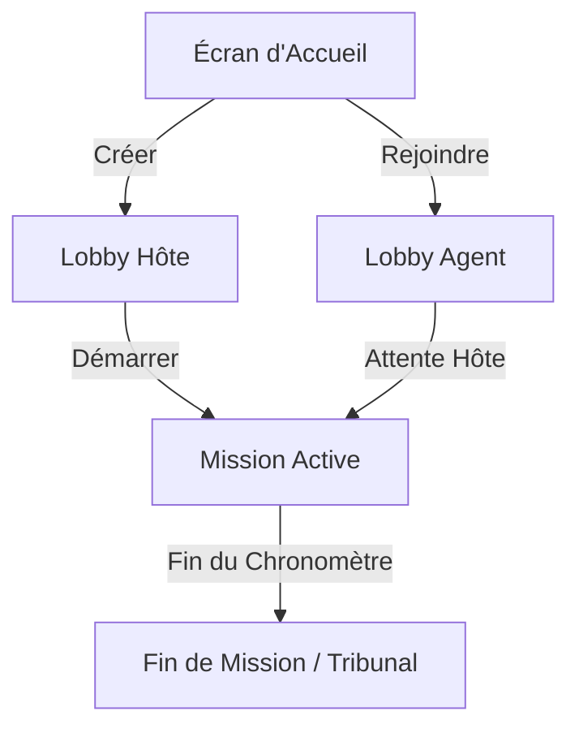

# Mécanismes de Jeu Actuels (État Post-Nettoyage)

Voici la description précise et exhaustive de l'ensemble des mécanismes de jeu opérationnels dans la base de code d'**Incognito** après le retrait des anciens systèmes de vote et de validation en temps réel.

---

## 1. Cycle de Vie d'une Partie

### A. Phase de Lobby (Pré-partie)
*   **Création de Session (Hôte)** : L'hôte définit la durée de la partie (ex: 20 minutes, 1 heure) et génère un code de salon unique à 4 caractères.
*   **Connexion (Agents)** : Les joueurs rejoignent la session en tapant le code ou en scannant le QR code généré sur l'écran de l'hôte.
*   **Attribution des Missions** : Lorsque l'hôte clique sur "Démarrer", chaque agent se voit attribuer un premier défi tiré aléatoirement de la base de données locale des défis (`CHALLENGES`). Le statut de la session passe à `ACTIVE` sur Firebase Realtime Database.

---

## 2. Gameplay Actif (Pendant la Mission)

L'écran principal en cours de jeu s'articule autour de trois composants principaux :

### A. La Carte d'Objectif Secret (Le Terminal Personnel)
*   **Cryptage de Sécurité** : Par défaut, l'objectif secret est masqué (affichage "Décryptage requis") pour éviter que des voisins de table ne lisent l'écran.
*   **Scan/Révélation** : Un appui long ou clic sur la carte simule un scan biométrique qui révèle le libellé exact de la mission.
*   **Sécurisation rapide** : Un nouvel appui masque instantanément le défi.
*   **Absence de Validation** : Il n'y a plus aucun bouton de validation en temps réel sur la carte. L'action est uniquement réalisée physiquement (IRL).

### B. Le Hub de Surveillance (Liste des Agents)
*   **Statut opérationnel** : Affiche la liste en temps réel des autres joueurs connectés à la table, leurs avatars et leurs scores actuels.
*   **Bouton d'Accusation Rapide ("Démasquer")** : Situé à côté du nom de chaque agent adverse. 
    *   Un clic ouvre une modale de confirmation.
    *   La confirmation génère un signalement de suspicion à toute la table.

### C. Le Flux d'Événements Tactiques (`ActiveEventFeed`)
*   **Logs Réseau** : Affiche un flux dynamique d'alertes en temps réel visibles par tous (ex: *"L'Agent Alpha soupçonne l'Agent Bêta"*).
*   **Micro-animations** : Les alertes apparaissent brièvement à l'écran puis s'estompent pour libérer de l'espace visuel.

### D. Gestion du Temps et Atmosphère
*   **Chronomètre Synchrone** : Le temps restant est calculé en continu.
*   **Mode Alerte (Dernière minute)** : Si le temps restant est inférieur à 60 secondes, une ambiance sonore de pulsation cardiaque (`HEARTBEAT`) se déclenche pour accentuer la tension de fin de partie.

---

## 3. Clôture de Partie (Fin de Mission)

*   **Changement d'État Automatique** : Lorsque le chronomètre global atteint zéro, l'hôte (ou le client le plus rapide) bascule la session Firebase en statut `FINISHED`.
*   **Splash Screen de Débriefing** : Un écran d'animation tactile noir et rouge signale la fin du temps réglementaire et redirige automatiquement tous les terminaux vers l'écran de Débriefing (`results.tsx`).
*   **Sauvegarde locale** : La session est réinitialisée dans la mémoire de l'appareil (`AsyncStorage`) pour permettre le lancement d'une nouvelle partie.
